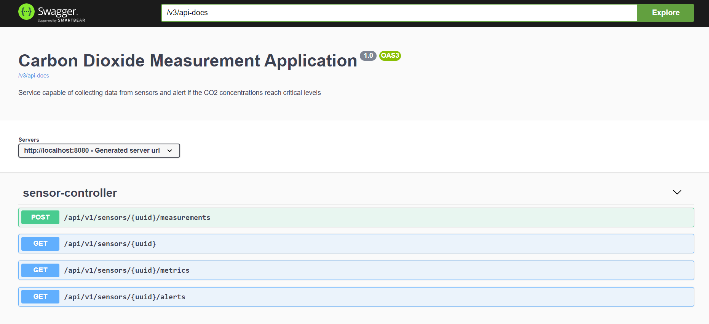

# Spring Boot Application 

## Requirements

For building and running the application you need:

- [JDK 11](https://www.oracle.com/java/technologies/javase-jdk11-downloads.html)

In case your using docker to run the application. 
You also need Docker, which only runs on 64-bit machines. See https://docs.docker.com/installation/#installation for details 
on setting Docker up for your machine. Before proceeding further, verify you can run docker commands from the shell.

## Running the Application

You can run the application by typing the following command in the terminal -

```shell script
  $ ./gradlew bootRun
```
The application will start at Spring Boot’s default port 8080.

## Build a Docker Image with Gradle
You can build a tagged docker image with Gradle in one command:

```shell script
  $ ./gradlew bootBuildImage
```
You can run the docker image using below command 

```shell script
  $ docker run -it -p 8080:8080 --name=Sensor-Measurement-Application co2-measurement:0.0.1-SNAPSHOT
```
In case if you do not know the image name use the ```$docker images``` command to list all the docker images

## Exploring the Rest APIs
The API specification are can be accessed using the below endpoint 
```shell
 http://localhost:8080/swagger-ui/index.html
```
This Open API specification gives the detailed description about each Rest API.

